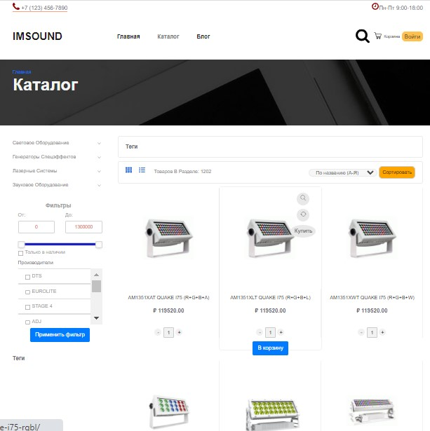

# ECommerce Website using Python 3.11 and Django Framework 4.2.1 / ECommerce веб-сайт на Python 3.11 и Django Framework 4.2.1
    
Welcome to the repository of the ECommerce website, using Python 3.11 and Django Framework 4.2.1. This project represents a fully-fledged web application for electronic commerce.

//////////////////////

Добро пожаловать в репозиторий сайта ECommerce, с использованием Python 3.11 и Django Framework 4.2.1. Проект представляет представляет собой полноценное веб-приложение для электронной коммерции.



## About the Project / О проекте

The project implements most of the functional requirements specific to the e-commerce domain.

- User authentication and management system.
- Content management mechanisms presented on the main page from the admin panel.
- Structured Product Catalog with optional display modes.
- Additional features for Products (new arrivals, discounts, related attributes, etc.).
- Catalog filtering mechanisms by a set of parameters, search, and sorting. Page pagination.
- Product comparison mechanism.
- Blocks such as "Similar Products," "Recommended Products," "Viewed Products."
- Order placement for registered/anonymous users, one-click orders.
- Shopping cart that stores its composition in the database/sessions (not reset when closing the page).
- Inventory management mechanisms.
- Bulk import/export of Products, SEO attributes.

- Article blog with categorization.
- Reviews and ratings for Products, Articles, with moderation capabilities.
- Functionality to create/edit content for "static" information pages from the admin panel.
- Use of WYSIWYG for editing large text blocks (product descriptions, article content, info pages).

- Ability to use promo codes, subscribe to newsletters.
- SEO attributes, tag clouds, clean URLs, breadcrumbs, generation of /sitemap.xml.
- Caching data using Redis, periodic Celery tasks for cache clearing, expired sessions.
- Automatic sending of notifications via Telegram ALERT bot upon the occurrence of certain events, using Celery.
- Administrative panel interfaces for all of the above.

## WARNING!!!
- User interactive actions, displaying modal windows, are handled by functional JS to minimize the number of page transitions and improve UI/UX. Static files are not included in the repository.
- Functionality related to different product offerings within a product card is not present.
    
## Technologies
Stack of technologies used:

- Python 3.11
- Django Framework 4.2.1
- PostgreSQL
- HTML/CSS
- JavaScript, jQuery slim
- Redis
- Celery
- Aiogramm

//////////////////////

В проекте реализовано большинство функциональных требований, специфичных для сферы электронной коммерции.

- Система аутентификации и управления пользователями.
- Механизмы управления контентом, представленным на главной страницы из админки. 
- Структурированный Каталог Товаров с опциональными режимами отображения.
- Дополнительные функциональные возможности для Товаров (новинки, скидки, связанные хар-ки и пр.)
- Механизмы фильтрации Каталога по набору параметров, поиска, и сортировки. Пагинация страниц.
- Механика сравнения товаров.
- Блоки "Похожие товары", "Рекомендованные товары", "Просмотренные товары".
- Оформление заказов для зарегистрированных/анонимных пользователей, заказы В 1 клик.
- Корзина товаров, хрянящая данные о своем составе в БД/сессиях, (не сбрасывается при закрытии страницы.
- Механизмы управления товарными остатками.
- Механизмы массового импорта/экспорта Товаров, SEO-аттрибутов.

- Статейный блог с разделением на Категории.
- Отзывы и рейтинги Товаров, Статей, с возможностью модерации. 
- Функционал создания/редактирования наполнением "статических" инфо-страниц из админ-панели
- Использование WYSIWIG для редактирования крупных текстовых блоков(описаний Товаров, контента Статей, инфо-страницы)

- Возможность использования Промо-кодов, Подписка на рассылку.
- SEO-аттрибуты, Облако тэгов, ЧПУ, "хлебные крошки", генерация /sitemap.xml,
- Кэширование данных c использованием Redis, периодические задачи Celery по очистке кэша, истекших сессий.
- Автоматическакя отправка уведомлений Telegram ALERT-ботом при наступлении определенных событий, с использованием Celery.   
- Интерфейсы управления в административной-панели для всего что было перечислено выше.  

## ВНИМАНИЕ!!!
- Интерактивные действия пользователя, показ модальных окон, обслуживается функциональным JS, для минимизации количества переходов между страницами
  и улучшения UI/UX. Статические файлы в репозиторий не вынесены.
- Функциональность, связанная с разными товарными предложениями внутри карточки товара отсутствуют.
## Технологии

Стек использованных технологий:

- Python 3.11
- Django Framework 4.2.1
- PostgreSQL
- HTML/CSS
- JavaScript, jQuery slim
- Redis
- Celery
- Aiogramm

## Installation / Установка

To run the project locally, follow these steps:

1. Contact me! Static files will be required for deployment.
2. Prepare your own .env file (configure Secret Key, Redis, PostgreSQL, SMTP server, TG bot).
3. Clone the repository to your local computer:
    ```bash
    git clone https://github.com/MikhailChupakhin/ecomm-store.git
  
4. cd ecomm-store
5. Activate the virtual environment.
6. Dependencies: pip install -r requirements.txt
7. Migrations: python manage.py migrate
8. python manage.py runserver
9. Visit http://127.0.0.1:8000/admin

//////////////////////


Чтобы запустить проект локально, выполните следующие шаги:

1. Свяжитесь со мной! Для развертывания потребуются статические файлы.
2. Подготовьте собственный файл .env (настройте Secret Key, Redis, PostgreSQL, SMTP-server, TG bot)
3. Склонируйте репозиторий на свой локальный компьютер:

   ```bash
   git clone https://github.com/MikhailChupakhin/ecomm-store.git
4. cd ecomm-store
5. Активируйте виртуальное окружение.
6. Зависимости: pip install -r requirements.txt
7. Миграции: python manage.py migrate
8. python manage.py runserver
9. http://127.0.0.1:8000/admin


## Contacts/ Контактная информация
Mikhail Chupakhin, TG @squarewheel, mchupakhinwork@gmail.com

